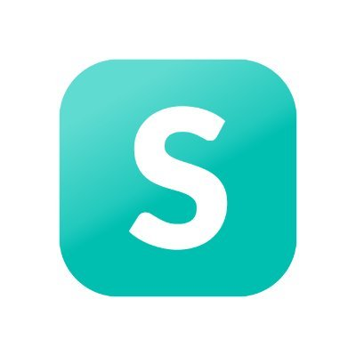

## Stutern Ltd
- *Backend Developer* | June'22 - May'23
- 
- Tags: Work
- Badges:
  - Badge [blue]
- List Items:
  - Created a REST API movies rental app that allows users to rent a movie using MongoDB, Mongoose, Express.js 
  - Created a REST API Learning Management System (Citrone web app) to ease learning activities for students MongoDB, Mongoose, Express.js, Bcrypt, JsonWebToken

## Jumia Nigeria
- *Aftersales Lead* | Sep'17 - Mar'18
- 
- Tags: Work
- Badges:
  - Badge [blue]
- List Items:
  - I supervised the cancellation team, assigned packages and ensured that quantity and quality check is observed while processing packages.
  - I did monthly review to ensure that packages were adequately processed and reconciled.
  - I helped maintain the placing and removal of packages in both the manual and system locations.
  - I also monitored and gave account of the total number of completed packages using Excel and Jumia processing apps (Hub Management Tool and Warehouse Management Tool)

## Company 3
- *Role* | Mar'23 - Apr'23
- 
- Tags: Category 3
- Badges:
  - Badge [blue]
- List Items:
  - Point 1
  - Point 2
